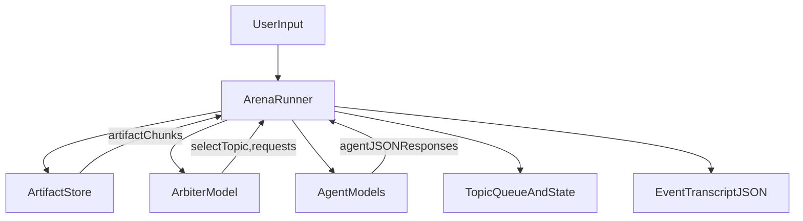

# Multi-agent debate arena (topic-driven)

## Current baseline (what we will build on)

- The arena currently runs a linear loop: **proposal → critique → revision → arbiter JSON stop decision** in `[/Users/nithishaddepalli/Documents/cv-fire/arena/arena.py](/Users/nithishaddepalli/Documents/cv-fire/arena/arena.py)` (see `run_arena()` around the proposal/critique/revision/stop sections).
- The CLI currently only supports fixed agent sets via `default_agents()` and `--agents 2|3` in `[/Users/nithishaddepalli/Documents/cv-fire/arena/cli.py](/Users/nithishaddepalli/Documents/cv-fire/arena/cli.py)`.

## Target behavior (your requirements mapped)

- **Reasonable but critical debate**: strengthen agent prompts + require structured outputs (proposal, critique, confidence, “no opinion” allowed).
- **Arbiter facilitation**: arbiter sees each agent’s structured output + confidence + reasoning; prioritizes open items; can declare “cannot resolve” and leave open.
- **Flexible compositions**: support arbitrary agent lists, including duplicates (e.g., `geminiA`, `geminiB`, `gpt`) rather than today’s fixed names.
- **Sub-topic tracking**: break the question/artifact into sub-topics; track per-round topics, conclusions, and arbiter decisions.
- **Deadlock control**: per-topic follow-up cap; arbiter must avoid choosing the exact same unresolved topic repeatedly; mark deadlocks explicitly.
- **Neutrality**: agents may return “no opinion” on a sub-topic and later re-engage.
- **Re-review sources**: arbiter/agents may request re-reading the artifact or referenced sources during an open discussion.
- **Optional discussion**: agents/arbiter may say “looks good” and move on.

## Architecture changes

### 1) Represent the artifact as file(s)

Because you selected **file_path**, we’ll introduce an `Artifact` abstraction:

- Inputs: one or more repo file paths (optionally with line ranges)
- Loader: reads content on demand (with size guards)
- “Re-review” support: arbiter can request `READ_ARTIFACT` or `READ_SOURCE(path)` actions; the arena executes them and appends results to context.

### 2) Switch from “single-thread debate” to “topic-driven”

Instead of one monolithic debate, the arena becomes a **topic queue** managed by the arbiter:

- A **Topic** has: `id`, `title`, `priority`, `status (open|resolved|deadlocked|skipped)`, `followups_used`, `max_followups`, `history`.
- Each step, the arbiter chooses:
  - next topic (possibly newly introduced)
  - or resolves/skips topics
  - or declares “I do not know” (leaves open items)

### 3) Make all model outputs structured JSON

To enable tracking/logic, require each agent turn to be strict JSON:

- `stance`: `support | oppose | neutral | no_opinion`
- `confidence`: 0..1
- `reasoning`: short
- `proposal`: concrete suggested change / answer
- `critiques`: list
- `requests`: optional actions like `READ_ARTIFACT`, `READ_SOURCE`

The arbiter turn is strict JSON with:

- `selected_topic_id`
- `topic_priority_updates`
- `decisions`: resolve/deadlock/skip
- `open_items`
- `final_answer` (only when ready)
- `reason`
- `requests` (read artifact/sources)

### 4) Agent identity + composition

Update config/CLI to accept an explicit list of agents with unique names even if provider/model duplicates.
Example composition:

- `geminiA` → provider `gemini`, model `...`
- `geminiB` → provider `gemini`, model `...`
- `gpt` → provider `gpt`, model `...`

### 5) Transcript upgrades

Replace the current `Turn(kind,text)` style with richer, typed events:

- `topic_created`, `topic_selected`, `agent_response`, `arbiter_decision`, `artifact_read`, `source_read`, `topic_resolved`, `topic_deadlocked`, etc.

This makes “track topics discussed and conclusions per round” automatic.

## Control logic (start / continue / stop)

### Start

- Load artifact file(s) (or lazily read a summary chunk)
- Arbiter creates initial topic list (or selects first topic) based on the question + artifact
- Agents respond on the selected topic (or say `no_opinion`)

### Continue (loop)

- Arbiter reviews latest agent JSON outputs
- Arbiter may request re-reads (artifact or sources) and then re-decide
- Arbiter updates topic priorities, marks resolved/deadlocked/skipped, or creates new topics
- Enforce **follow-up caps**:
  - If `followups_used >= max_followups` and topic unresolved → mark `deadlocked`
  - Arbiter must not select a deadlocked topic
  - If the last selected topic is still unresolved, arbiter must pick a different topic unless it provides an explicit “why” and `followups_used` allows it

### Stop

- Stop if:
  - all topics resolved/skipped/deadlocked AND arbiter provides final synthesis, OR
  - arbiter sets `final_answer` and `agree=true` (or equivalent), OR
  - global max steps reached (safety guard)
- Output:
  - final answer
  - open items (including arbiter “I don’t know” items)
  - full transcript with per-topic history

## CLI changes

Extend `[/Users/nithishaddepalli/Documents/cv-fire/arena/cli.py](/Users/nithishaddepalli/Documents/cv-fire/arena/cli.py)` to accept file-based artifacts and custom agent lists.
Proposed UX:

- `arena run --artifact path1 --artifact path2 --agent gemini:MODEL:geminiA --agent gemini:MODEL:geminiB --agent gpt:MODEL:gpt --arbiter gpt:MODEL:arbiter`
- `--topic-max-followups N` (deadlock limit)
- `--max-steps N` (global safety)

## Dataflow diagram

## Files we’ll add/change

- Change: `[/Users/nithishaddepalli/Documents/cv-fire/arena/arena.py](/Users/nithishaddepalli/Documents/cv-fire/arena/arena.py)` — replace linear loop with topic-driven loop + structured parsing + deadlock logic
- Change: `[/Users/nithishaddepalli/Documents/cv-fire/arena/cli.py](/Users/nithishaddepalli/Documents/cv-fire/arena/cli.py)` — accept `--artifact` and repeated `--agent` specs
- Add: `arena/artifact.py` — artifact + source reading, size guards
- Add: `arena/topics.py` — Topic model, queue, status transitions, follow-up counters
- Add: `arena/schemas.py` — Pydantic schemas for agent/arbiter JSON outputs + validation
- Add: `arena/prompts.py` — consistent prompts for agent roles and arbiter facilitation

## Acceptance checks

- Can run with **2 Gemini + 1 GPT** by specifying 3 agents with unique names
- Transcript JSON includes:
  - topics list and per-topic history
  - per-round selections and arbiter decisions
  - conclusions + open items
  - deadlocked topics and why
- Agents can emit `no_opinion` and later participate
- Arbiter can request artifact/source re-reads during discussion
- Arbiter can leave unresolved items explicitly (“I don’t know”) without forcing fake agreement

